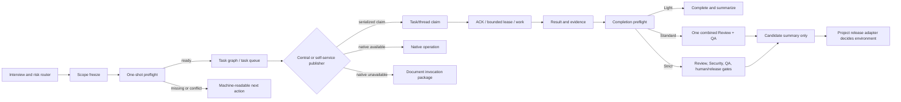

# Multi-Agent Collaboration Fast Lane and Self-Service Dispatch Implementation Plan

> 中文阅读版：[`2026-08-09-多智能体协同-快车道与自助发布实施计划.md`](./2026-08-09-多智能体协同-快车道与自助发布实施计划.md)

> **For agentic workers:** REQUIRED SUB-SKILL: Use `superpowers:executing-plans` to implement this plan task-by-task. The default execution style is inline and bounded; do not create extra Agents unless the user explicitly approves them.

**Goal:** Remove avoidable multi-Agent waiting and repeated governance handoffs by adding a one-shot preflight, an explicit fast execution profile, bounded recovery, and a serial self-service dispatch/claim lane, while keeping Strict/release work fail-closed.

**Architecture:** Keep the existing Protocol v3 document bus as the canonical fact source and keep Codex native messages as an execution adapter. Add a mode/profile router and read-only preflight before dispatch, then add an authorized self-service publisher that can create and dispatch child tasks without waking the main Coordinator. All task, resource, and thread claims are serialized by run-local locks, immutable records, and scope checks; self-service never grants release permission or bypasses Strict human/security gates.

**Tech Stack:** Python 3 standard library CLI scripts, the repository's flat YAML/JSON protocol subset, immutable Markdown/YAML/JSON documents, Codex native/document adapters, `unittest`, Git evidence, and existing Protocol v3 state replay.

## Global Constraints

- Only modify files inside `/Users/yancyfeng/Desktop/Mac Dpxx项目/skills/multi-agent-collaboration`; do not modify the proposal or the installed user-level copy while implementing this plan.
- Keep `PROTOCOL_VERSION = "3"` for the first release; add only backward-compatible optional fields and actor capabilities. Existing v3 runs remain readable and central-dispatch compatible.
- Bump the Skill version from `1.3.0` to `1.4.0` only after the P0 behavior, tests, and documentation pass. Project delivery versions remain governed by each project's version contract and are never changed by this Skill release.
- Keep the existing public governance values `light`, `standard`, and `strict`; document the proposal aliases `L`, `S`, and `X` without requiring a CLI rename.
- `execution_profile: fast` reduces handoffs, prompts, and waiting only; it never downgrades a risk classification or removes a Strict gate.
- New Agents are not created for dispatch, queue, version, release, security, or timeout mechanics. Existing Coordinator, Owner, and combined Quality capabilities are reused.
- The default composition is one Coordinator/Owner for Light, Owner plus one combined Reviewer/QA Agent for Standard, and only the independent capabilities required by Strict project rules.
- No command starts a daemon, busy-polls, fabricates ACK/lease/result/review/QA evidence, or turns a successful native message into a completed task.
- Self-service publication is allowed only inside a frozen parent scope, with an authorized publisher capability, a real registered target/claimant, an immutable parent causation reference, and a serialized non-conflicting write transaction.
- A task or native thread can have at most one active claim. Claim conflicts return a bounded machine-readable conflict; they do not spin or silently steal work.
- Strict database, payment, permission, secret, production, migration, deployment, release, and rollback gates remain fail-closed and remain project-adapter-driven.
- All new CLI commands support `--dry-run` and stable JSON output. Exit code `0` means ready/success, `2` means actionable missing/conflict/blocking information, and `3` means malformed or unsafe protocol input.

## 1. Problem Definition and Success Criteria

### 1.1 Current failure pattern

The current Skill has a correct but expensive chain: an Agent reaches a gate, asks the Coordinator to inspect it, the Coordinator asks another Agent to fill a missing field, the run is rescanned, and the same cycle repeats. The costly part is not the document write; it is the serial wake-up and repeated human/context transfer. Current `references/modes-and-gates.md`, `scripts/emit_event.py`, and `scripts/validate_run.py` also apply some completion/dispatch checks only after work has already started.

### 1.2 Desired behavior

| Situation | New behavior | Still forbidden |
| --- | --- | --- |
| Light research/document/test task | One Owner can finish with task/result/summary; no Reviewer or QA wake-up is required | Claiming release or production readiness |
| Fast Standard code task | One Owner and one combined independent Quality capability; one preflight lists all gaps before dispatch | Bypassing review/QA or allowing Owner self-review |
| Strict or release task | Existing fail-closed gates; preflight lists all missing evidence once | Automatic downgrade, automatic production release, or fake evidence |
| Owner does not ACK/renew lease | A bounded timeout produces a real blocked/recovery record and releases the occupied slot | Infinite lease, silent task mutation, unbounded retry |
| Working Agent discovers a child task | It can publish and dispatch the child directly when authorized | Expanding parent scope, conflicting owned paths, or creating an unregistered Agent |
| Multiple Agents want the same task/thread | First serialized valid claim wins; the loser receives the holder and next action | Concurrent ownership, silent takeover, or busy polling |
| Native adapter is unavailable | The same self-service operation writes a document invocation package | Reporting “woken” or “completed” without an operation/result document |

### 1.3 Measurable acceptance targets

1. A new Light/fast Run performs one preflight and never requires a Reviewer/QA handoff.
2. A Standard/fast Run reports all missing dispatch/completion fields in one JSON response and uses at most one combined Quality handoff per task.
3. A timeout cannot leave an expired lease occupying a slot after the next bounded tick.
4. Two concurrent task or thread claims produce exactly one active winner and no duplicate owner/lease.
5. A working Agent can publish an authorized child task without a Coordinator wake; the event and operation trail still verifies end-to-end.
6. Strict and release validation remains at least as restrictive as the current v3 behavior.
7. Candidate summaries never imply MG/production permission; the project adapter remains the release authority.

## 2. Target Runtime Model

### 2.1 Governance versus execution profile

The run keeps two independent decisions:

```text
governance = light | standard | strict       # risk and evidence floor
execution_profile = fast | normal            # latency preference only
dispatch_policy = central | hybrid | self_service
```

`dispatch_policy=central` preserves the current behavior. `hybrid` lets the Coordinator run global ready waves while authorized working Agents publish/dispatch scoped child tasks. `self_service` permits the same scoped operation without waiting for a Coordinator tick; it still runs the same preflight and event validation. New Light/Standard runs default to `hybrid`; new Strict runs default to `central` unless the project adapter explicitly permits `hybrid`. Existing runs are treated as `central` when the fields are absent.

The mode router uses the highest matching risk:

| Trigger | Suggested governance | Suggested profile |
| --- | --- | --- |
| Research, planning, document, content, isolated read-only test | `light` | `fast` |
| UI, API, script, normal code, local test, shared service | `standard` | `normal`; `fast` when urgent |
| Database, payment, funds, permission, secret, provider, storage, deployment, release, rollback, production | `strict` | `normal` |

The Coordinator may record a higher mode or a faster profile with a reason. It may not record a lower mode when a higher-risk trigger is present.

### 2.2 Minimal Agent composition

The HTML catalog remains a static “who can do what” guide and does not become a status board. At Run time, the plan is:

- **Light:** one Agent may hold `coordinator`, `owner`, and `task_publisher` capabilities for a bounded task.
- **Standard:** one Owner plus one independent Agent with both `review` and `qa` capabilities. A separate Reviewer and QA Agent are not created unless permissions or execution environments make the merge invalid.
- **Strict:** Coordinator remains the version/gate owner; Owner and the combined Quality capability are reused; Security/Data/Release capabilities are added only when a project rule requires an independently authorized boundary.
- **Self-service:** a capability on an existing Agent, not a new “Dispatcher Agent.”

### 2.3 End-to-end flow



## 3. Data Contracts to Freeze Before Coding

### 3.1 Run manifest additions

Add these flat fields to newly initialized manifests and `assets/manifest.yaml.template`:

```yaml
execution_profile: "fast"
dispatch_policy: "hybrid"
preflight_required: true
scope_freeze_ref: "null"
scope_freeze_ref_sha256: "null"
retry_policy_ref: "<run-dir>/config/retry-policy.yaml"
retry_policy_ref_sha256: "<sha256>"
self_service_parent_scope: "task_owner_or_declared_collaborator"
```

The fields are optional when reading older runs and become required for new runs. `preflight_required` is never false for Strict. `retry_policy_ref` points to an immutable run-local policy snapshot, not a global mutable Skill file.

### 3.2 Task additions

Extend the task template/schema with:

```yaml
assignment_mode: "fixed"                 # fixed | claimable
eligible_agents: []                       # required when claimable
published_by: "coordinator"              # creator/publisher identity
parent_task_id: "null"                   # required for self-service child tasks
parent_task_sha256: "null"
resource_steps: "[]"                     # JSON list of {step_id, kind, resources}
```

`fixed` keeps the existing registered `owner_agent` semantics. `claimable` uses the reserved owner value `pool` only in the frozen task document; an immutable claim document supplies the effective owner before `TASK_DISPATCHED`. No task result is accepted while a claim is absent or expired.

### 3.3 Preflight result contract

Every preflight command returns one JSON object with this shape:

```json
{
  "schema_version": "1.0",
  "run_id": "RUN-...",
  "task_ids": ["TASK-001"],
  "governance": "standard",
  "execution_profile": "fast",
  "dispatch_policy": "hybrid",
  "ready": false,
  "missing": [
    {"field": "git_status_ref", "owner": "coordinator", "reason": "standard completion evidence"}
  ],
  "conflicts": [],
  "blocked_by": [],
  "required_actions": ["record accepted git_status evidence before dispatch"],
  "estimated_handoffs": 1,
  "next_action": "record_evidence",
  "checked_at": "<iso8601>"
}
```

The result is a report, not an event and not a release decision. `missing`, `conflicts`, and `blocked_by` must be deterministic and sorted.

### 3.4 Scope freeze contract

`decisions/scope-freeze.yaml` is immutable and contains:

- `scope_id`, `run_id`, `objective_sha256`, and `created_at`;
- requested/allowed paths and the normalized forbidden paths;
- pre-existing dirty files explicitly excluded from the Run;
- task/change IDs already approved;
- target environment, `max_parallel`, governance, execution profile, and dispatch policy;
- version contract and retry policy hashes;
- `owner_agent: coordinator` and user confirmation reference.

Any child task or self-service publication must prove its paths are a subset of this record. A scope expansion creates a new task revision and human gate; it never edits this record.

### 3.5 Retry policy contract

The run-local immutable policy defaults to:

```yaml
ack_timeout_seconds: 600
progress_timeout_seconds: 900
result_timeout_seconds: 600
max_attempts_light: 2
max_attempts_standard: 2
max_attempts_strict: 1
owner_noop_action: "blocked_then_reassign"
auto_retry_light: true
auto_retry_standard: false
auto_retry_strict: false
immutable_events: true
```

Project adapters may tighten values. They may not increase Strict automatic retry or turn an unknown side-effect state into a safe retry.

### 3.6 Claim records

Claims are immutable documents under `claims/tasks/` and `claims/threads/`:

```yaml
protocol_version: 3
kind: "task_claim"
claim_id: "CLAIM-..."
run_id: "RUN-..."
task_id: "TASK-..."
task_sha256: "..."
claimer_agent: "A02-owner"
eligible_agents: ["A02-owner", "A03-worker"]
lease_acquired_at: "<iso8601>"
lease_expires_at: "<iso8601>"
parent_causation_id: "<event-or-task-id>"
status: "active"
```

The thread variant adds `thread_id`, platform/session binding hash, workspace, and the task claim ID. Claim files are never edited; release/expiry is a new record and event/recovery action.

## 4. Implementation Work Plan

Each task below is independently testable. The implementation should be executed in order, with a focused commit after each green test group. The order intentionally puts the read-only contracts before any state-writing optimization.

### Task 0: Freeze the compatibility baseline

**Files:**

- Create: `tests/test_fast_lane_contract.py`
- Modify: `tests/README.md`

**Interfaces:**

- Consumes: current `VERSION`, `scripts/protocol_lib.py`, existing fixture helpers.
- Produces: tests proving Protocol v3 event/state behavior and central dispatch remain unchanged until the new fields are explicitly present.

- [ ] Write tests that assert `PROTOCOL_VERSION == "3"`, current v3 runs without optimization fields still validate, Light completion still cannot emit release, and strict release requirements remain fail-closed.
- [ ] Run `PYTHONDONTWRITEBYTECODE=1 python -m unittest tests.test_fast_lane_contract`; record the expected baseline failure only for the new test module before implementation.
- [ ] Add the test module and update test documentation with the Python command used by this repository.
- [ ] Run the focused test and the existing full suite; require all baseline tests to remain green.
- [ ] Commit as `test: freeze protocol v3 fast-lane compatibility contract`.

### Task 1: Add the mode/profile/dispatch contract

**Files:**

- Modify: `scripts/init_run.py` (`parse_args`, manifest/directory initialization)
- Modify: `scripts/manage_run.py` (`RUN_CONFIG_FIELDS`, `configure-run`, task creation arguments)
- Modify: `scripts/protocol_lib.py` (allowed profile/policy helpers)
- Modify: `assets/manifest.yaml.template`
- Modify: `assets/task.md.template`
- Modify: `assets/schemas/task.schema.json`
- Modify: `assets/README.md`
- Test: `tests/test_mode_profile.py`

**Interfaces:**

- `init_run.py` accepts `--execution-profile {fast,normal}` and `--dispatch-policy {auto,central,hybrid,self_service}`.
- `manage_run.py configure-run` can set `execution_profile`, `dispatch_policy`, and `preflight_required` only before the first `TASK_READY` event; after dispatch, a change requires a new Run.
- `protocol_lib.py` exposes `validate_execution_profile(governance, profile)` and `default_dispatch_policy(governance)`.

- [ ] Write failing tests for default policy (`hybrid` for Light/Standard, `central` for Strict), invalid fast/strict downgrades, and legacy manifests defaulting to central/normal.
- [ ] Implement the small validation helpers without embedding DPXX product or environment names.
- [ ] Add the fields and an immutable `config/retry-policy.yaml` directory to new Run initialization; keep the existing `versions/version-contract.yaml` unchanged.
- [ ] Make task creation copy the run profile, publisher, parent, assignment, and resource metadata into the frozen task document.
- [ ] Run `PYTHONDONTWRITEBYTECODE=1 python -m unittest tests.test_mode_profile` and the baseline suite.
- [ ] Commit as `feat: add fast execution and dispatch policy contracts`.

### Task 2: Implement shared preflight analysis

**Files:**

- Create: `scripts/preflight_lib.py`
- Create: `scripts/preflight_run.py`
- Create: `assets/schemas/preflight-result.schema.json`
- Create: `assets/preflight-result.json.template`
- Modify: `scripts/README.md`
- Test: `tests/test_preflight.py`

**Interfaces:**

- `preflight_lib.run_preflight(run_dir: Path, task_ids: list[str] | None, *, now: datetime | None) -> dict[str, object]`
- `preflight_run.py --run-dir <dir> [--task-id <id>] [--mode <mode>] [--dry-run]` prints the contract in section 3.3.
- Exit codes: `0` ready, `2` missing/conflict/blocked, `3` malformed run.

- [ ] Write fixtures for Light, Standard, and Strict runs with missing fields, path conflicts, stale claims, and invalid version hashes.
- [ ] Assert one report lists all missing fields, sorted by stable field name, instead of stopping at the first failure.
- [ ] Assert Light does not list version contract, registry, release, review, or QA as missing; Standard lists the combined quality refs; Strict lists all required gates.
- [ ] Assert `--dry-run` writes no event, operation, task, claim, or manifest file.
- [ ] Implement checks for run structure, task hashes, owner/quality independence, dependencies, owned/forbidden paths, active locks/claims, Git state, version contract, strict adapter refs, and native/document binding references.
- [ ] Keep preflight read-only and reuse existing `protocol_lib`, `event_records`, `replay_task_states`, `frontmatter`, and Git helpers instead of duplicating parsing rules.
- [ ] Run the focused tests and then the full suite.
- [ ] Commit as `feat: add one-shot run preflight and machine-readable gaps`.

### Task 3: Implement completion preflight

**Files:**

- Create: `scripts/completion_preflight.py`
- Modify: `scripts/preflight_lib.py`
- Modify: `scripts/README.md`
- Test: `tests/test_completion_preflight.py`

**Interfaces:**

- `completion_preflight.py --run-dir <dir> --task-id <id> [--dry-run]` returns the same report shape with `next_action` focused on completion evidence.
- `preflight_lib.run_completion_preflight(run_dir: Path, task_id: str) -> dict[str, object]`.

- [ ] Write tests proving Light requires result/summary/changed-files-if-any only; Standard requires implementation commit or explicit uncommitted reason, branch/status evidence, handoff, verification, and combined Review/QA; Strict adds change ID, registry, version contract, A09/A10/A11-equivalent evidence, migration/backup/rollback, target authorization, and candidate prerequisites.
- [ ] Implement mode-specific requirements without changing event history or auto-generating evidence.
- [ ] Ensure missing evidence identifies the responsible existing Agent/capability and the exact command/document to create it.
- [ ] Integrate the command into `validate_run.py --phase completion` as an optional preflight report before the existing fail-closed validator.
- [ ] Run focused and full tests.
- [ ] Commit as `feat: add mode-aware completion preflight`.

### Task 4: Freeze scope and dirty-file boundaries

**Files:**

- Create: `scripts/freeze_scope.py`
- Create: `assets/scope-freeze.yaml.template`
- Modify: `scripts/init_run.py`
- Modify: `scripts/manage_run.py`
- Modify: `scripts/validate_run.py`
- Modify: `references/modes-and-gates.md`
- Test: `tests/test_scope_freeze.py`

**Interfaces:**

- `freeze_scope.py --run-dir <dir> --requested-path <path> ... --forbidden-path <path> ... --target-environment <name> [--dry-run]`.
- `preflight_lib.load_scope_freeze(run_dir) -> (Path, dict[str, str])`.

- [ ] Write tests for path normalization, parent/child overlap, outside-project rejection, explicit pre-existing dirty-file exclusions, and immutable second-write rejection.
- [ ] Implement scope freeze after the task graph is created and before the first `TASK_READY`; store the file/hash in the manifest.
- [ ] Require every new self-service task to reference the parent scope and prove owned paths are a subset.
- [ ] Make `validate_run.py` reject a new task that expands frozen scope without a new task revision and human gate; keep old runs without a scope file in legacy central mode.
- [ ] Run focused and full tests.
- [ ] Commit as `feat: freeze run scope before task dispatch`.

### Task 5: Bound ACK/lease/result timeouts and recovery

**Files:**

- Create: `scripts/recover_timeout.py`
- Modify: `scripts/coordinator.py` (`_timeouts`, `tick`, CLI)
- Modify: `scripts/protocol_lib.py` (timeout evidence helpers only; do not add fake completion transitions)
- Modify: `scripts/manage_run.py` (`write-result`/retry policy checks)
- Modify: `references/coordinator-runtime.md`
- Modify: `references/document-protocol.md`
- Test: `tests/test_timeout_recovery.py`

**Interfaces:**

- `recover_timeout.py --run-dir <dir> --task-id <id> --action block|retry --side-effect-state none|unknown|confirmed [--dry-run]`.
- `coordinator.py --run-dir <dir> --once` returns `timeouts` with deadline, attempt, `blocked_by`, `next_action`, and policy; it never loops.
- `recover_timeout.py` writes an immutable timeout evidence document first, then emits a real `BLOCKED` or explicit `TASK_FAILED -> RETRY_SCHEDULED -> TASK_RESUMED` sequence only when protocol preconditions hold.

- [ ] Write tests for ACK timeout, expired lease, missing result, retry exhaustion, and malformed timestamp behavior.
- [ ] Assert the first recovery action releases the expired claim/lease from scheduling and leaves the old event/result untouched.
- [ ] Permit automatic retry only for Light when policy says so and side effects are `none`; Standard retry requires an explicit recovery command; Strict never auto-retries unknown side effects.
- [ ] Add a stable timeout report to `coordinator.tick` without making it a daemon or calling `write-dead-letter` without a real failure event.
- [ ] Ensure `BLOCKED` is recoverable only through a new immutable attempt; never hand-edit a task back to `running`.
- [ ] Run focused and full tests.
- [ ] Commit as `feat: bound timeout recovery and release stale work slots`.

### Task 6: Add authorized self-service task publication

**Files:**

- Create: `scripts/dispatch_lib.py`
- Create: `scripts/agent_dispatch.py`
- Modify: `scripts/protocol_lib.py` (`parse_agent_profiles`, publisher capability helpers)
- Modify: `scripts/manage_run.py` (`create-task` shared task builder and publication metadata)
- Modify: `scripts/emit_event.py` (authorized publisher actor checks)
- Modify: `scripts/validate_run.py` (publisher/parent/scope validation)
- Modify: `assets/agents.yaml.template`
- Modify: `references/document-protocol.md`
- Modify: `references/adapters.md`
- Modify: `references/coordinator-runtime.md`
- Test: `tests/test_self_service_dispatch.py`

**Interfaces:**

- `agent_dispatch.py publish --run-dir <dir> --publisher-agent <agent> --parent-task <task-id> --task-id <task-id> --title <title> --objective <text> --owner-agent <agent|pool> --owned-path <path> ... [--dry-run]`.
- `dispatch_lib.authorize_publication(run_dir, publisher_agent, parent_task, child_spec) -> PublicationDecision`.
- `dispatch_lib.publish_task(run_dir, child_spec, *, dry_run: bool) -> dict[str, object]`.

Add optional run-local Agent capabilities parsed from `agents.yaml`:

```yaml
capabilities: ["task_publish", "task_claim", "thread_claim"]
```

The existing Coordinator has all three capabilities. An Owner receives `task_publish` only when the run policy allows it. `task_claim` and `thread_claim` are explicit capabilities; they are not inferred from a role name.

- [ ] Write tests proving an authorized working Owner can publish a child task without invoking `coordinator.py` or waking the Coordinator.
- [ ] Require the child dependency list to include the parent task or a completed upstream task, require parent task hash/causation, and reject cycles.
- [ ] Require child owned paths to be within the frozen scope and parent publisher scope; reject active-task/lock conflicts before any write.
- [ ] Require Standard/Strict child Reviewer/QA independence and reuse the existing combined Quality Agent; reject self-review.
- [ ] Require Strict children with risk flags to carry the existing human-gate/change/registry references; no self-service command can create `RELEASE_READY`.
- [ ] Implement a deterministic transaction: acquire the run publication lock, validate all inputs, stage the task, update the manifest index, emit `TASK_READY`/`TASK_DISPATCHED` with `from_agent=<publisher>` and `causation_id=<parent>`, write the native/document operation, and publish only after every check passes. A failed transaction leaves only an auditable staging/recovery record and no ready event.
- [ ] Make `emit_event.py` accept a registered Agent with `task_publish` for `TASK_READY` and `TASK_DISPATCHED` only when the parent/claim/scope decision is valid. Keep Coordinator-only authority for release, user gates, task completion in Standard/Strict, retry exhaustion, dead-letter, and version operations.
- [ ] Run focused and full tests.
- [ ] Commit as `feat: allow scoped self-service child task publication`.

### Task 7: Add serial task and native-thread claiming

**Files:**

- Create: `scripts/agent_claim.py`
- Modify: `scripts/init_run.py` (create `claims/tasks` and `claims/threads`)
- Modify: `scripts/dispatch_lib.py`
- Modify: `scripts/emit_event.py` (claim causation and effective owner resolution)
- Modify: `scripts/validate_run.py`
- Modify: `scripts/adapters/codex.py`
- Modify: `scripts/adapters/document.py`
- Modify: `references/codex-native-protocol.md`
- Modify: `references/document-subagent-protocol.md`
- Test: `tests/test_claims.py`

**Interfaces:**

- `agent_claim.py claim-task --run-dir <dir> --task-id <id> --agent-id <agent> --lease-seconds <n> [--dry-run]`.
- `agent_claim.py claim-thread --run-dir <dir> --task-id <id> --agent-id <agent> --thread-id <id> --platform <codex|hermes> --workspace <path> --lease-seconds <n> [--dry-run]`.
- `agent_claim.py release-task|release-thread --claim-ref <path> --reason <text>` writes a new immutable release record; it never edits the original claim.
- `dispatch_lib.resolve_effective_owner(run_dir, task_id, at: datetime) -> str | None`.

Claim rules:

- A `fixed` task cannot be stolen. A `claimable` task has an `eligible_agents` allow-list and is dispatched only after one valid claim.
- Claim acquisition uses one run-local exclusive lock and a deterministic scan of active claim documents. The first successful serialized acquisition wins; a conflict exits `2` with holder/expiry/next action.
- Expired claims do not become silently reusable for Strict tasks. Light/Standard can reclaim after a timeout evidence/recovery record proves the prior attempt was released.
- A thread claim must match a real native/session binding when the adapter requires one and must match the exact workspace. A document task may claim a logical execution slot without pretending it owns a Codex thread.
- Claim records include task/thread hashes, parent causation, lease interval, and operation ID. ACK/lease/result filenames and actor checks resolve the effective owner from the active claim.

The task-claim transaction is explicitly ordered: acquire the claim lock, verify task state/eligibility/scope, write the immutable claim, then emit the existing `TASK_DISPATCHED` event with `from_agent=<claimer>`, `to_agent=<claimer>`, and `causation_id=<claim_id>`. If dispatch or adapter delivery fails, the claim stays auditable and is recovered through the bounded timeout path; no second Agent may start the same attempt. Releasing a claim writes a new release record and uses the existing blocked/resume recovery sequence, never a hand-edited owner field.

- [ ] Write a two-process race test for task claims and a separate race test for the same thread; assert exactly one active claim and no duplicate dispatch.
- [ ] Write tests for fixed-task rejection, ineligible-agent rejection, parent-scope rejection, expired-claim handling, and strict side-effect `unknown` handling.
- [ ] Implement claim files and effective-owner resolution without changing the frozen task document.
- [ ] Make native/document adapters consume the same claim record and carry its hash in the invocation package.
- [ ] Run focused and full tests.
- [ ] Commit as `feat: add serialized task and thread claims`.

### Task 8: Decouple resource-free steps from resource-required steps

**Files:**

- Modify: `scripts/coordinator.py`
- Modify: `scripts/manage_run.py` (`lock`/resource queue support)
- Modify: `scripts/preflight_lib.py`
- Modify: `assets/task.md.template`
- Modify: `assets/schemas/task.schema.json`
- Modify: `references/document-protocol.md`
- Modify: `references/modes-and-gates.md`
- Test: `tests/test_resource_queue.py`

**Interfaces:**

- `manage_run.py lock queue|acquire|renew|release` with optional `--step-id` and `--queue-key`.
- `preflight_lib.resource_step_status(task, active_locks, claims) -> list[dict[str, object]]`.

- [ ] Write tests proving a task can read, inspect, prepare tests, and write a handoff while waiting for a high-conflict resource, while a resource-required step remains blocked.
- [ ] Implement a FIFO queue record for each resource bundle; validate all requested resources and the base HEAD before granting any part of a bundle.
- [ ] Ensure parent/child path locks and logical locks remain conflict-safe; never partially grant a bundle.
- [ ] Include queue position and `next_action=wait_for_queue_grant` in preflight output.
- [ ] Run focused and full tests.
- [ ] Commit as `feat: separate resource-free work from resource leases`.

### Task 9: Integrate preflight and self-service into the bounded Coordinator tick

**Files:**

- Modify: `scripts/coordinator.py`
- Modify: `scripts/wake_agent.py`
- Modify: `scripts/adapters/codex.py`
- Modify: `scripts/adapters/document.py`
- Modify: `references/coordinator-runtime.md`
- Test: `tests/test_coordinator_fast_lane.py`

**Interfaces:**

- `coordinator.tick(..., preflight: bool = True, now: datetime | None = None) -> dict[str, object]`.
- CLI `--dry-run` always runs preflight but writes no event/operation/package.
- Real dispatch refuses to proceed when required preflight is not ready; it prints the complete report rather than waking another Agent to discover the same gap.

- [ ] Write tests for one bounded tick with a ready Light task, blocked Standard task, strict missing-gate task, and self-service task; assert no repeated wake and no event on a failed preflight.
- [ ] Add a preflight section to the tick JSON (`preflight`, `ready_set`, `blocked_conflicts`, `timeouts`, `dispatches`).
- [ ] Preserve idempotent operation IDs and document fallback behavior. A native command exit `0` means only `message_sent`; outbox/result evidence is required for progress/completion.
- [ ] Add a `--central-only` compatibility switch for migration/canary runs; do not add a daemon or hidden retry loop.
- [ ] Run focused and full tests.
- [ ] Commit as `feat: gate bounded coordinator ticks with one-shot preflight`.

### Task 10: Generate candidate summaries without deciding release

**Files:**

- Create: `scripts/build_candidate_index.py`
- Create: `assets/schemas/candidate-summary.schema.json`
- Create: `assets/candidate-summary.yaml.template`
- Modify: `scripts/manage_run.py` (`record-release-candidate` links)
- Modify: `references/version-governance.md`
- Modify: `references/adapters.md`
- Modify: `scripts/README.md`
- Test: `tests/test_candidate_index.py`

**Interfaces:**

- `build_candidate_index.py --run-dir <dir> [--task-id <id>] [--dry-run]` prints a candidate summary containing `release_scope_id`, `change_id`, `implementation_commit`, `handoff_ref`, `review_ref`, `qa_ref`, `release_permission`, `target_environment`, and `blocked_reason`.
- `release_permission` is always an observed reference/status (`granted`, `missing`, `blocked`, `not_applicable`), never a newly granted permission.

- [ ] Write tests for Light/Standard/Strict output, missing evidence, multiple RCs, mismatched commits, and project adapters that use non-DPXX environment names.
- [ ] Implement deterministic candidate ordering and hash every referenced artifact.
- [ ] Ensure the command does not write `RELEASE_READY`, change registry records, or deployment state.
- [ ] Document that the project Release-Ops adapter, not this Skill, decides MG/production.
- [ ] Run focused and full tests.
- [ ] Commit as `feat: build release candidate summaries without release authority`.

### Task 11: Unify native and document delivery facts

**Files:**

- Modify: `scripts/wake_agent.py`
- Modify: `scripts/adapters/codex.py`
- Modify: `scripts/adapters/document.py`
- Modify: `scripts/runtime_metadata.py`
- Modify: `scripts/validate_run.py`
- Modify: `references/adapters.md`
- Modify: `references/codex-native-protocol.md`
- Test: `tests/test_adapter_fact_source.py`

**Interfaces:**

- `wake_agent.wake_agent(...)` returns `message_sent`, `fallback_document`, or `failed` plus operation/package refs; it never returns `completed`.
- `validate_run.py` verifies that a native operation, claim, invocation package, and outbox/result document refer to the same `run_id`, `task_id`, task hash, claim hash, and workspace.

- [ ] Write tests for native success without result, native failure with document fallback, duplicate retry, and mismatched workspace/session map.
- [ ] Implement the post-delivery evidence check and keep document bus as the canonical state machine.
- [ ] Add the same invocation metadata to self-service dispatch and Coordinator dispatch.
- [ ] Run focused and full tests.
- [ ] Commit as `fix: make native and document delivery share one fact source`.

### Task 12: Add migration, rollback, and compatibility behavior

**Files:**

- Create: `scripts/migrate_run_optimization.py`
- Modify: `scripts/validate_run.py`
- Modify: `scripts/manage_run.py`
- Modify: `references/cross-platform-resume.md`
- Modify: `references/version-governance.md`
- Test: `tests/test_optimization_migration.py`

**Interfaces:**

- `migrate_run_optimization.py --run-dir <dir> --dry-run` reports the fields that would be added; `--apply` writes only missing optional config fields and never rewrites events/tasks/results.
- `migrate_run_optimization.py --rollback` removes only newly added mutable config pointers when no optimized event/claim exists; it refuses destructive removal after self-service evidence exists.

- [ ] Write tests for legacy v3 central runs, partially configured runs, archived runs, and runs with existing optimized claims.
- [ ] Implement default `normal/central/preflight_required=false` for legacy runs and `fast/hybrid/preflight_required=true` only for new runs or explicit opt-in.
- [ ] Confirm old event actor rules remain valid and new authorized publisher rules do not allow retroactive reinterpretation of old events.
- [ ] Run focused and full tests.
- [ ] Commit as `feat: add reversible optimization configuration migration`.

### Task 13: Update user-facing documentation and static Agent catalog

**Files:**

- Modify: `SKILL.md`
- Modify: `README.md`
- Modify: `CHANGELOG.md`
- Modify: `VERSION`
- Modify: `agents/openai.yaml`
- Modify: `agents.html`
- Modify: `references/README.md`
- Modify: `references/interview-and-planning.md`
- Modify: `references/modes-and-gates.md`
- Modify: `references/coordinator-runtime.md`
- Modify: `references/document-protocol.md`
- Modify: `references/adapters.md`
- Modify: `scripts/README.md`
- Modify: `tests/test_skill_contract.py`
- Modify: `tests/test_agent_catalog.py`

**Documentation requirements:**

- Explain Chinese and English names clearly: “多智能体协同 / Multi-Agent Collaboration”.
- Explain the entry point: inspect `agents.html`, choose the minimum existing Agent capability, then initialize a Run and select governance/profile/policy.
- Explain that Light/fast is the default quick path for low-risk work; Standard/Strict do not lose safety gates.
- Explain self-service publication, task/thread claims, FIFO/serialization, scope freeze, and the exact conflict/timeout recovery actions.
- Explain that a working Agent can publish a child task without waking the main Coordinator only when `task_publish` and parent/scope checks pass.
- Explain that a claim is not a new Agent and that no role is created solely for dispatch or version governance.
- Explain `preflight_run.py`, `completion_preflight.py`, `agent_dispatch.py`, `agent_claim.py`, `recover_timeout.py`, and `build_candidate_index.py` with commands and exit codes.
- Keep the HTML catalog static: capability descriptions are allowed; live task status, orchestration graphs, and automatic launch buttons are not added.
- State the Skill release as `1.4.0`, keep Protocol v3, and distinguish Skill version, Protocol version, Run/attempt/RC numbers, and project delivery version.

- [ ] Write documentation tests for the new commands, modes, version boundary, and no-release/no-fake-evidence rules.
- [ ] Update the static catalog only with durable capability text and manual launch prompts.
- [ ] Run documentation and full tests.
- [ ] Commit as `docs: document fast lane and self-service collaboration`.

### Task 14: Verification, benchmark, and release handoff

**Files:**

- Create: `tests/fixtures/optimization/` fixtures for Light, Standard, Strict, self-service, timeout, and adapter fallback.
- Create: `docs/superpowers/plans/2026-08-09-fast-lane-and-self-service-dispatch.md` (this plan is the implementation record).
- Modify: `CHANGELOG.md` if final verification adds a user-visible note.

- [ ] Run the focused suites in this order: mode/profile, preflight, completion preflight, scope, timeout, self-service dispatch, claims, resource queue, coordinator, adapters, candidate index, migration, catalog/skill contract.
- [ ] Run the complete suite with `PYTHONDONTWRITEBYTECODE=1 python -m unittest discover -s tests -p 'test_*.py'`.
- [ ] Run every new CLI with `--help`, `--dry-run`, a valid fixture, and a malformed fixture; record exit code and JSON shape.
- [ ] Measure a representative Light task and a Standard/fast task: number of Agent wake-ups, number of handoffs, time to first actionable result, and time from owner result to completion preflight. The benchmark must not call any external production adapter.
- [ ] Verify the full Strict fixture still fails closed for missing change/registry/security/environment/rollback/human/release evidence.
- [ ] Verify a self-service child task appears in the canonical document bus and native/document operation records without a Coordinator wake.
- [ ] Verify concurrent claims, expired leases, and stale native sessions cannot create two active owners.
- [ ] Run secret scans on all generated fixtures and command output; no credentials may appear.
- [ ] Update `VERSION` to `1.4.0` only after all checks pass and run the final full suite again.
- [ ] Commit as `chore: release multi-agent collaboration 1.4.0`.

## 5. Rollout and Rollback Strategy

### 5.1 Staged rollout

1. **Read-only phase:** ship `preflight_run.py`, `completion_preflight.py`, and candidate index in dry-run mode. Existing Runs remain central and unchanged.
2. **Light canary:** create a new Light/fast/hybrid Run for a document or test task. Confirm one Owner, no Review/QA wake-up, one preflight, and a complete result/summary.
3. **Standard canary:** use a local UI/API/script task with one combined Quality Agent. Confirm preflight lists all gaps before `TASK_READY`, and that fast profile does not remove Review/QA.
4. **Self-service canary:** have an authorized working Agent publish one non-conflicting child task and claim one queue task/thread. Run the two-process race test and inspect the canonical event/operation/claim trail.
5. **Timeout canary:** use a fixture with an intentionally missing ACK/expired lease. Confirm bounded BLOCKED/recovery and no old event mutation.
6. **Strict shadow phase:** run preflight and candidate index against a local strict fixture; do not connect to MG, Chengdu, production, real credentials, payment, or external provider paths.
7. **Default enablement:** new Light/Standard runs default to hybrid; Strict remains central unless the project adapter explicitly opts into scoped self-service.

### 5.2 Rollback

- Set new runs to `dispatch_policy=central` and `execution_profile=normal`; no event history changes are required.
- Stop using `agent_dispatch.py`/`agent_claim.py`; existing central `coordinator.py` and Protocol v3 continue to operate.
- Revert the Skill files to `1.3.0` only if compatibility tests show a regression. Protocol v3 and project delivery versions remain unchanged.
- Do not delete claim, operation, result, or evidence records. Archive them and mark the Run blocked/superseded through the existing immutable events.
- Never use rollback to grant release permission or to hide a failed self-service attempt.

## 6. Risks and Mitigations

| Risk | Mitigation | Fail-closed condition |
| --- | --- | --- |
| Self-service publisher expands scope | Parent task hash, scope-freeze subset check, publication lock, immutable causation | Reject before task/index/event write |
| Two Agents claim one task/thread | One exclusive claim lock, one active claim, immutable lease | Return conflict; no second owner |
| Publisher self-reviews | Mode preflight checks Owner versus Reviewer/QA identity and capabilities | `TASK_READY` rejected |
| Native message says success but no work happened | Operation + invocation package + ACK/result evidence check | State remains `message_sent` |
| Timeout retry repeats an external side effect | Side-effect state required; Strict unknown is non-retryable | BLOCKED and human recovery |
| Fast profile weakens security | Router takes highest risk; strict policy cannot be lowered | Preflight and validator reject |
| Extra Agent proliferation | Capabilities live on existing registry entries; no dispatcher role | Publication rejected if it requests unregistered Agent |
| Project rules leak into generic Skill | Adapter fields and project refs are opaque to generic code | Generic Skill never enumerates MG/Chengdu |
| Legacy run breaks after upgrade | Optional fields, default central/normal, migration is additive | Old v3 validation must remain green |
| Candidate summary is mistaken for release | `release_permission` is observational and adapter-owned | No `RELEASE_READY` or deployment mutation |

## 7. Final Definition of Done

The optimization is complete only when all of the following are true:

- The Skill is `1.4.0`; Protocol remains v3; README/SKILL/Changelog/OpenAI metadata and static Agent catalog agree.
- Light/fast has a real no-extra-Agent path and does not require version/release/Review/QA evidence.
- Standard/fast has one combined independent Quality handoff and a single preflight gap list.
- Strict remains fail-closed and has no automatic downgrade or production action.
- `preflight_run.py` and `completion_preflight.py` are deterministic, read-only by default, JSON-producing, and tested.
- Timeout recovery is bounded, immutable, side-effect-aware, and does not fabricate failure or completion.
- A working authorized Agent can publish a child task and dispatch it without waking the main Coordinator; the operation is serial, scoped, and auditable.
- Task and native-thread claims are first-writer-wins under a lock, with no duplicate active owner and no silent stealing.
- Resource-free work can continue while resource-required steps wait in a FIFO conflict-safe queue.
- Native and document adapters refer to the same task/claim/hash/workspace facts; fallback is explicit.
- Candidate summaries are consumable by project Release-Ops but never grant release permission.
- Legacy v3 central Runs validate unchanged, and the full Python test suite passes.
